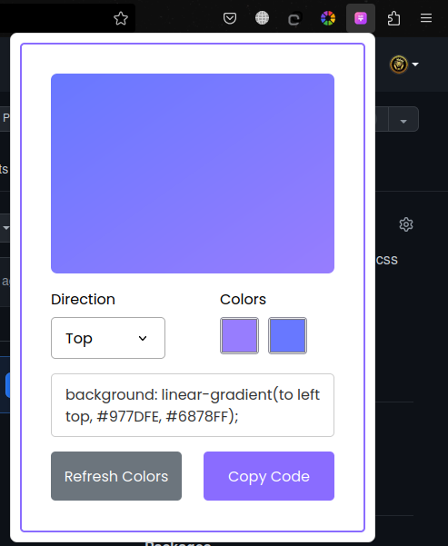

# GRADIENT GENERATOR EXTENSION
#### Video Demo:  <URL https://youtu.be/hNdRT5Bi24Q>
#### Description
Gradient Generator is, a Chrome/FireFox extenion that allows users to generate 
custom gradients, then copy the code

#### Screenshots

##### Installation
clone the repo from github
[https://github.com/munyite001/Gradient-Gen.git](https://github.com/munyite001/Gradient-Gen.git)

Then open your Chrome browser

Navigate to extensions

Click on load Unpacked extenion

Navigate to the project folder, and that's it

